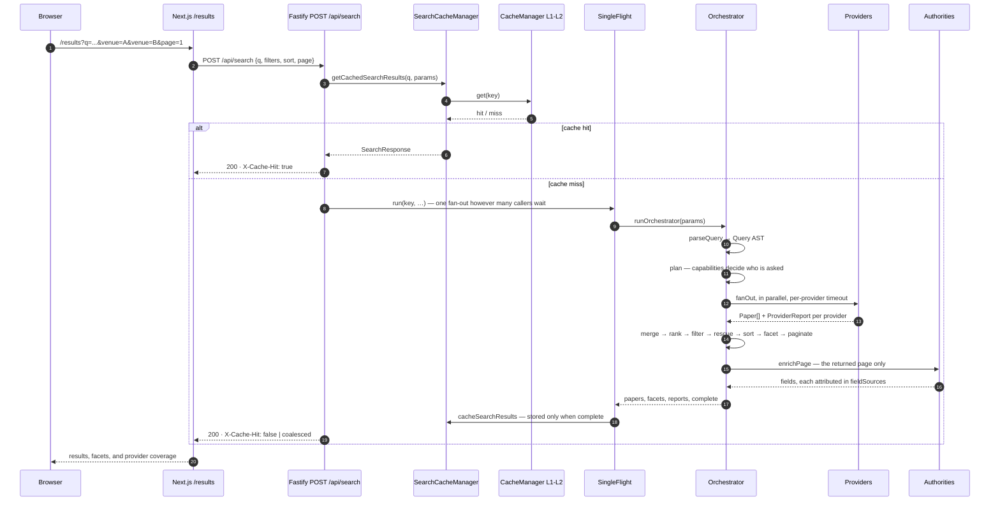
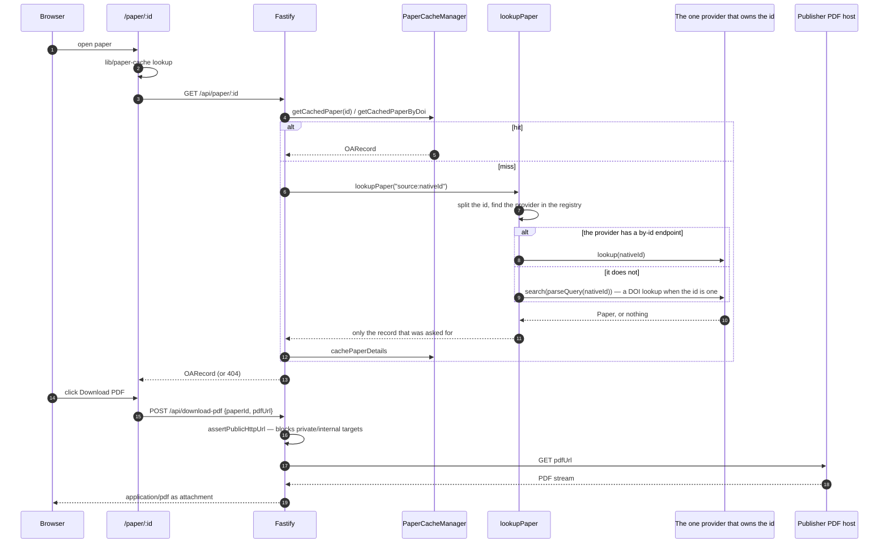
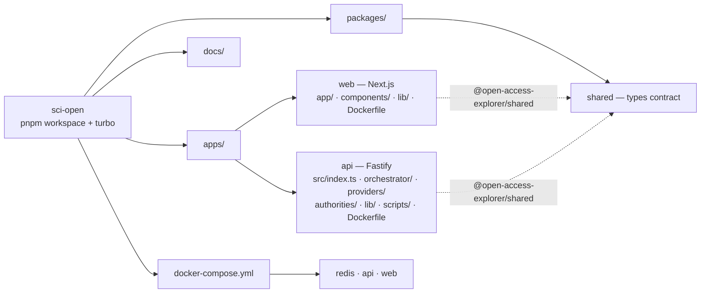

# Architecture Diagram

Mermaid diagrams of the whole application. The fenced blocks below render
directly in GitHub, VS Code, and most Markdown viewers.

Standalone SVG renders live in [`diagrams/`](./diagrams):

| Diagram | SVG |
| --- | --- |
| System map | [`diagrams/system-map.svg`](./diagrams/system-map.svg) |
| Search request flow | [`diagrams/search-flow.svg`](./diagrams/search-flow.svg) |
| Paper detail and PDF download | [`diagrams/paper-pdf-flow.svg`](./diagrams/paper-pdf-flow.svg) |
| Repository layout | [`diagrams/repo-layout.svg`](./diagrams/repo-layout.svg) |

Regenerate them after editing a block below:

```bash
npx -p @mermaid-js/mermaid-cli mmdc -i docs/architecture-diagram.md -o docs/diagrams/out.svg -b white
```

## 1. System map

```mermaid
flowchart TB
  USER(["User's browser"])

  %% ============ FRONTEND ============
  subgraph WEB["apps/web — Next.js 14 · port 3000"]
    direction TB

    subgraph PAGES["App Router"]
      HOME["/ — HomePage<br/>hero + search entry"]
      RESULTS["/results — search results<br/>server component"]
      PAPERPG["/paper/:id — paper detail"]
      PROXY["/api/:path* — route handler<br/>resolves API_ORIGIN per request"]
      LAYOUT["layout.tsx — shell + Tailwind"]
    end

    subgraph COMPS["Components"]
      SBAR["AdvancedSearchBar — the query box"]
      FACET["FacetPanel → FacetGroup · SortBar · Pagination"]
      RLIST["PaginatedResults · ResultCard<br/>LoadingSkeleton · EmptyState"]
      COVER["ProviderCoverage<br/>per-provider status · degradation notice"]
      EXPORTUI["ExportButton · WoSExportDialog"]
      PDETAIL["PaperHeader · PaperAbstract · PaperMetadata<br/>PaperActions · PaperCitations · RelatedPapers"]
      UIKIT["ui/ — shadcn primitives"]
    end

    subgraph WEBLIB["lib/"]
      FETCH["fetcher.ts — the only place an API origin is decided"]
      PCACHE["paper-cache.ts — client-side cache"]
      CITE["bibtex.ts · citations.ts — BibTeX and RIS"]
      SPARAMS["search-params.ts — repeated params, not comma-joined"]
    end
  end

  %% ============ API ============
  subgraph API["apps/api — Fastify · port 4000"]
    direction TB

    PLUGINS["@fastify/cors · @fastify/helmet · @fastify/rate-limit"]

    subgraph ROUTES["Routes — src/index.ts, registered as a plugin"]
      direction TB
      subgraph PUBROUTES["Public"]
        R_SEARCH["POST /api/search"]
        R_PAPER["GET /api/paper/:id"]
        R_PDF["POST /api/download-pdf"]
        R_HEALTH["GET /health"]
      end
      GATE{{"adminOnly<br/>Bearer ADMIN_API_KEY<br/>fails closed when unset"}}
      subgraph ADMROUTES["Administrative"]
        R_CACHE["/api/cache/metrics · /clear"]
        R_PERF["/api/performance/*"]
      end
      GATE --> ADMROUTES
    end

    subgraph ORCH["Orchestrator — src/orchestrator/"]
      direction TB
      O1["parseQuery → Query AST"]
      O2["plan<br/>capabilities decide who is asked"]
      O3["fanOut<br/>parallel · per-provider timeout · ProviderReport"]
      O4["mergePapers<br/>dedupe by DOI, then identity key"]
      O5["rank<br/>rank fusion over each provider's order"]
      O6["applyPolicy → sortPapers → generateFacets → paginate"]
      O7["enrichPage<br/>the page only, because authorities are per-DOI"]
      O8["toSearchResponse<br/>Paper[] → the wire contract"]
      LOOKUP["lookupPaper<br/>one record, by the id results carry"]
    end

    PCACHE2["ProviderCache<br/>what each provider returned, across requests"]
    FLIGHT["SingleFlight<br/>concurrent identical searches share one fan-out"]
    PDFPROXY["pdf-proxy.ts<br/>SSRF guard + stream"]
    PERFMON["httpPerformanceMonitor<br/>read by the admin routes only"]
    HTTPF["http-client-factory<br/>keep-alive pooling · http-pool-config"]
  end

  %% ============ CACHE ============
  subgraph CACHE["Cache — src/lib/cache*"]
    direction TB
    CM["CacheManager<br/>key: namespace:hash(subject):hash(variant)"]
    L1[("L1 · MemoryCache<br/>bounded in bytes, LRU")]
    L2[("L2 · Redis<br/>ioredis, walked with SCAN")]
    SCM["SearchCacheManager<br/>one key per request<br/>a degraded answer is not stored"]
    PCM["PaperCacheManager<br/>by id and by DOI"]
  end

  %% ============ SHARED PACKAGES ============
  subgraph PKGS["packages/"]
    SHARED["shared — Paper · Query · ProviderCapabilities<br/>ProviderReport · OARecord adapters"]
  end

  %% ============ EXTERNAL ============
  subgraph PROVIDERS["Providers — src/providers/ · sources of results"]
    direction LR
    S_ARXIV["arXiv"]
    S_EPMC["Europe PMC"]
    S_NCBI["PubMed"]
    S_DOAJ["DOAJ"]
    S_PLOS["PLOS"]
    S_OPENAIRE["OpenAIRE"]
    S_CORE["CORE"]
    S_BIO["bioRxiv / medRxiv"]
    S_DATACITE["DataCite"]
    S_OPENALEX["OpenAlex"]
  end

  subgraph AUTHORITIES["Authorities — src/authorities/ · asked about a record"]
    direction LR
    A_CR["Crossref"]
    A_UP["Unpaywall"]
    A_OA["OpenAlex"]
    A_OC["OpenCitations"]
  end

  subgraph INFRA["Infrastructure — docker-compose.yml"]
    REDIS[("Redis 7")]
  end

  PUBLISHERS[["Publisher / repository PDF hosts"]]

  %% ---- edges: user → web ----
  USER --> HOME
  USER --> RESULTS
  USER --> PAPERPG

  HOME --> SBAR
  RESULTS --> SBAR
  RESULTS --> FACET
  RESULTS --> RLIST
  RESULTS --> COVER
  RESULTS --> EXPORTUI
  PAPERPG --> PDETAIL
  RLIST -.-> UIKIT
  FACET -.-> UIKIT
  FACET --> SPARAMS

  SBAR --> FETCH
  RLIST --> FETCH
  PDETAIL --> FETCH
  PAPERPG --> PCACHE
  PCACHE --> FETCH
  EXPORTUI --> CITE

  FETCH -->|"relative in the browser"| PROXY
  PROXY ==>|HTTP| ROUTES

  %% ---- edges: routes → internals ----
  PLUGINS -.-> ROUTES
  R_SEARCH --> SCM
  R_SEARCH --> FLIGHT
  FLIGHT --> O1
  R_PAPER --> PCM
  R_PAPER --> LOOKUP
  R_PDF --> PDFPROXY
  R_CACHE --> CM
  R_PERF --> PERFMON

  %% ---- orchestrator internal order ----
  O1 --> O2 --> O3 --> O4 --> O5 --> O6 --> O7 --> O8

  O3 --> PCACHE2
  O3 --> PROVIDERS
  O7 --> AUTHORITIES
  LOOKUP -->|"by-id endpoint, or the provider's search"| PROVIDERS

  PROVIDERS --> HTTPF
  AUTHORITIES --> HTTPF
  HTTPF --> PERFMON
  PDFPROXY --> PUBLISHERS

  %% ---- cache wiring ----
  SCM --> CM
  PCM --> CM
  CM --> L1
  CM --> L2
  L2 --- REDIS

  %% ---- packages / infra ----
  SHARED -.->|types| WEB
  SHARED -.->|types| API

  %% ---- styling (stroke only, so it reads in light and dark) ----
  classDef page stroke:#2563eb,stroke-width:2px
  classDef store stroke:#7c3aed,stroke-width:2px
  classDef core stroke:#dc2626,stroke-width:2px
  class HOME,RESULTS,PAPERPG page
  class L1,L2,REDIS store
  class O4,O5,O7 core
```



**Providers and authorities are different kinds of thing**, which is why they
are separate boxes. A provider answers a query with records. An authority is
asked about a record that is already in hand, and never adds one — so an
authority failing leaves the result set whole, while a provider failing makes
`total` a lower bound and the response says so.

`plan` decides who is asked, from declared capabilities rather than from a
score. bioRxiv has no keyword index — its API scans a date window — so it is
skipped for keyword searches and answers DOI lookups in full; the response
lists it under "not searched for this query" rather than as a failure. DataCite
is skipped on the same kind of evidence.

## ## 2. Search request flow



The single flight is around the whole miss, so the two waiters on one key share
the fan-out *and* the cache write. A miss costs tens of seconds across ten
providers, which is a wide window for duplicates.

`complete: false` reaches the page as a notice: a provider that failed makes
the count a lower bound, and one that was skipped is listed separately, because
declining to guess is not a failure.

## ## 3. Paper detail and PDF download



Opening a paper triggers no search. `RelatedPapers` renders the topics already
on the record as links to the searches they stand for, rather than running a
second full fan-out to produce four of them.

## ## 4. Repository layout


