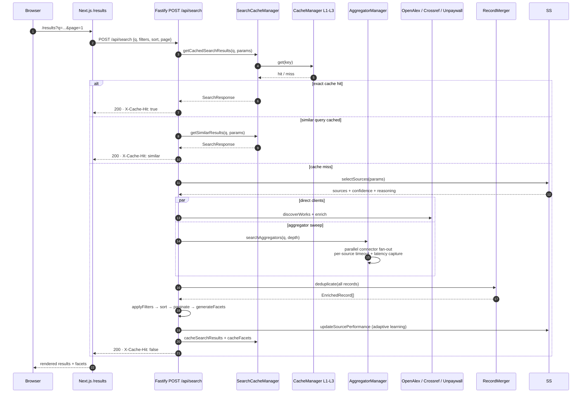
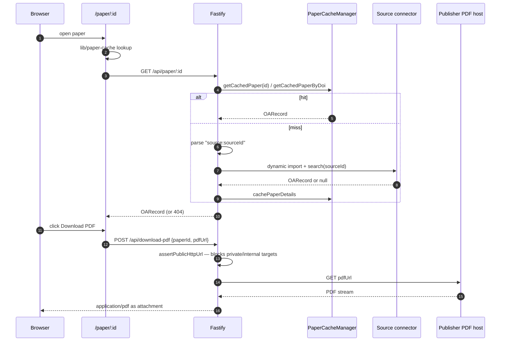
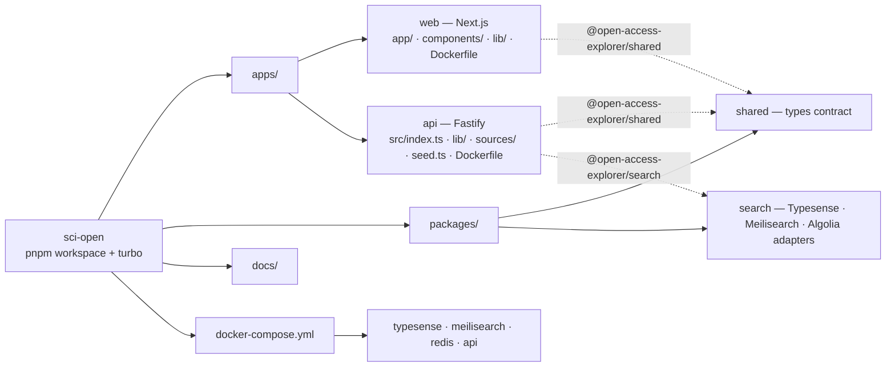

# Architecture Diagram

Mermaid diagrams of the whole application. The fenced blocks below render
directly in GitHub, VS Code, and most Markdown viewers.

Standalone SVG renders live in [`diagrams/`](./diagrams):

| Diagram | SVG |
| --- | --- |
| System map | [`diagrams/system-map.svg`](./diagrams/system-map.svg) |
| Search request flow | [`diagrams/search-flow.svg`](./diagrams/search-flow.svg) |
| Paper detail and PDF download | [`diagrams/paper-pdf-flow.svg`](./diagrams/paper-pdf-flow.svg) |
| Repository layout | [`diagrams/repo-layout.svg`](./diagrams/repo-layout.svg) |

Regenerate them after editing a block below — the committed SVGs predate the
phase-2 deletions and still show the removed cache-warming and source-selection
nodes:

```bash
npx -p @mermaid-js/mermaid-cli mmdc -i docs/architecture-diagram.md -o docs/diagrams/out.svg -b white
```

## 1. System map

```mermaid
flowchart TB
  USER(["User's browser"])

  %% ============ FRONTEND ============
  subgraph WEB["apps/web — Next.js 14 · port 3000"]
    direction TB

    subgraph PAGES["App Router"]
      HOME["/ — HomePage<br/>hero + search entry"]
      RESULTS["/results — search results<br/>server component"]
      PAPERPG["/paper/:id — paper detail<br/>client component"]
      LAYOUT["layout.tsx — shell + Tailwind"]
    end

    subgraph COMPS["Components"]
      SBAR["AdvancedSearchBar / SearchBar<br/>SearchHistory · SearchHelp · SearchExamples"]
      FACET["FacetPanel · SortBar · Pagination"]
      RLIST["PaginatedResults · InfiniteResults<br/>ResultCard · LoadingSkeleton · EmptyState"]
      EXPORTUI["ExportButton · EnhancedExportButton<br/>WoSExportDialog"]
      PDETAIL["PaperHeader · PaperAbstract · PaperMetadata<br/>PaperActions · PaperCitations · RelatedPapers"]
      CDASH["CacheDashboard"]
      UIKIT["ui/ — shadcn primitives<br/>button · card · select · slider · tabs · popover"]
    end

    subgraph WEBLIB["lib/"]
      FETCH["fetcher.ts — axios client"]
      PCACHE["paper-cache.ts — client-side cache"]
      CITE["bibtex.ts · citations.ts — export formats"]
    end

    RW{{"next.config.js rewrite<br/>/api/* → NEXT_PUBLIC_API_BASE"}}
  end

  %% ============ API ============
  subgraph API["apps/api — Fastify · port 4000"]
    direction TB

    PLUGINS["@fastify/cors · @fastify/helmet"]

    subgraph ROUTES["Routes — src/index.ts"]
      direction TB
      subgraph PUBROUTES["Public"]
        R_SEARCH["POST /api/search"]
        R_PAPER["GET /api/paper/:id"]
        R_PDF["POST /api/download-pdf"]
        R_HEALTH["GET /health"]
      end
      GATE{{"requireAdmin<br/>Bearer ADMIN_API_KEY<br/>fails closed when unset"}}
      subgraph ADMROUTES["Administrative"]
        R_CACHE["/api/cache/metrics · /clear"]
        R_PERF["/api/performance/*"]
        R_DEBUG["/debug/sources · /debug/aggregators"]
      end
      GATE --> ADMROUTES
    end

    subgraph PIPE["EnhancedSearchPipeline"]
      direction TB
      P1["normalizeQuery + isDoiQuery"]
      P4["Parallel fan-out<br/>FallbackManager · Promise.allSettled"]
      P5["RecordMerger<br/>dedupe by DOI + identity key"]
      P6["enrichWorks<br/>OpenAlex → Crossref → Unpaywall"]
      P7["applyFilters → sortResults → paginate"]
      P8["generateFacets<br/>source · year · venue · publisher · topics · oaStatus"]
    end

    AGG["AggregatorManager<br/>fans out to all connectors"]
    PDFPROXY["pdf-proxy.ts<br/>SSRF guard + stream"]
    PERFMON["httpPerformanceMonitor<br/>httpPerformanceTester"]
    HTTPF["http-client-factory<br/>keep-alive pooling · http-pool-config"]
    SEED["seed.ts — index into search backend"]
  end

  %% ============ CACHE ============
  subgraph CACHE["Cache layer — src/lib/cache*"]
    direction TB
    CM["CacheManager"]
    L1[("L1 · NodeCache<br/>in-process, ~5 min")]
    L2[("L2 · Redis<br/>ioredis, ~1 h")]
    L3[("L3 · in-memory map<br/>long TTL, ~24 h")]
    SCM["SearchCacheManager<br/>exact + similar-query hits"]
    PCM["PaperCacheManager<br/>by id and by DOI"]
  end

  %% ============ SHARED PACKAGES ============
  subgraph PKGS["packages/"]
    SHARED["shared — OARecord · SearchParams<br/>SearchResponse · SourceConnector"]
    SEARCHPKG["search — SearchAdapter<br/>Typesense · Meilisearch · Algolia"]
  end

  %% ============ EXTERNAL ============
  subgraph SOURCES["Source connectors — src/sources/"]
    direction LR
    S_ARXIV["arXiv"]
    S_EPMC["Europe PMC"]
    S_NCBI["NCBI"]
    S_DOAJ["DOAJ"]
    S_PLOS["PLOS"]
    S_OPENAIRE["OpenAIRE"]
    S_CORE["CORE"]
    S_BIO["bioRxiv / medRxiv"]
    S_DATACITE["DataCite"]
    S_OC["OpenCitations"]
    S_CR["Crossref"]
    S_UP["Unpaywall"]
  end

  subgraph CLIENTS["Metadata clients — src/lib/clients/"]
    C_OA["OpenAlexClient<br/>discovery + enrichment"]
    C_CR["CrossrefClient"]
    C_UP["UnpaywallClient<br/>OA PDF resolution"]
  end

  subgraph INFRA["Infrastructure — docker-compose.yml"]
    REDIS[("Redis 7")]
    TYPESENSE[("Typesense 0.25")]
    MEILI[("Meilisearch 1.5")]
  end

  PUBLISHERS[["Publisher / repository PDF hosts"]]

  %% ---- edges: user → web ----
  USER --> HOME
  USER --> RESULTS
  USER --> PAPERPG

  HOME --> SBAR
  RESULTS --> SBAR
  RESULTS --> FACET
  RESULTS --> RLIST
  RESULTS --> EXPORTUI
  PAPERPG --> PDETAIL
  RLIST -.-> UIKIT
  FACET -.-> UIKIT

  SBAR --> FETCH
  RLIST --> FETCH
  PAPERPG --> PCACHE
  PCACHE --> FETCH
  EXPORTUI --> CITE
  PDETAIL --> RW
  CDASH --> RW
  FETCH --> RW

  RW ==>|HTTP| ROUTES

  %% ---- edges: routes → internals ----
  PLUGINS -.-> ROUTES
  R_SEARCH --> SCM
  R_SEARCH --> PIPE
  R_PAPER --> PCM
  R_PAPER -->|"dynamic import by source prefix"| SOURCES
  R_PAPER --> C_OA
  R_PDF --> PDFPROXY
  R_CACHE --> CM
  R_PERF --> PERFMON
  R_DEBUG --> PIPE
  R_DEBUG --> AGG

  %% ---- pipeline internal order ----
  P1 --> P4 --> P5 --> P6 --> P7 --> P8

  P4 -->|openalex| C_OA
  P4 -->|crossref| C_CR
  P4 -->|"all other sources, one sweep"| AGG
  P1 -->|"DOI query — bypasses selection"| C_CR
  P6 --> C_CR
  P6 --> C_UP

  AGG --> S_EPMC
  AGG --> S_NCBI
  AGG --> S_ARXIV
  AGG --> S_DOAJ
  AGG --> S_PLOS
  AGG --> S_OPENAIRE
  AGG --> S_CORE
  AGG --> S_DATACITE
  AGG --> S_BIO
  AGG -.-> S_OC

  SOURCES --> HTTPF
  CLIENTS --> HTTPF
  HTTPF --> PERFMON
  PDFPROXY --> PUBLISHERS

  %% ---- cache wiring ----
  SCM --> CM
  PCM --> CM
  CM --> L1
  CM --> L2
  CM --> L3
  L2 --- REDIS

  %% ---- packages / infra ----
  SHARED -.->|types| WEB
  SHARED -.->|types| API
  SEED --> SEARCHPKG
  SEARCHPKG --> TYPESENSE
  SEARCHPKG --> MEILI
  SEARCHPKG -.->|optional| ALGOLIA(["Algolia SaaS"])

  %% ---- styling (stroke only, so it reads in light and dark) ----
  classDef page stroke:#2563eb,stroke-width:2px
  classDef store stroke:#7c3aed,stroke-width:2px
  classDef ext stroke:#059669,stroke-width:2px
  classDef core stroke:#dc2626,stroke-width:2px
  class HOME,RESULTS,PAPERPG page
  class L1,L2,L3,REDIS,TYPESENSE,MEILI store
  class S_ARXIV,S_EPMC,S_NCBI,S_DOAJ,S_PLOS,S_OPENAIRE,S_CORE,S_BIO,S_DATACITE,S_OC,S_CR,S_UP,C_OA,C_CR,C_UP,PUBLISHERS,ALGOLIA ext
  class P5,P6 core
```



`OpenCitations` is the one dotted edge: it is registered in `AggregatorManager`
with `keywordSearch: false` because it resolves citations for a known DOI and has
no keyword endpoint, so a keyword sweep can only ever get nothing from it. Every
solid edge is queried on each keyword search.

`bioRxiv / medRxiv` is a special case among the solid edges. Its API has no
keyword endpoint, so the connector scans a recent date window and filters
client-side; its coverage is the last 30 days of preprints, not the whole
corpus. It answers DOI lookups from `GET /api/paper/:id` in full.

## 2. Search request flow



## 3. Paper detail and PDF download



## 4. Repository layout


