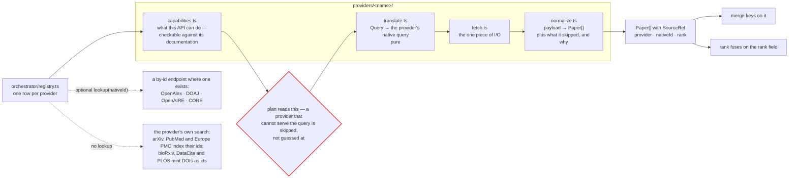
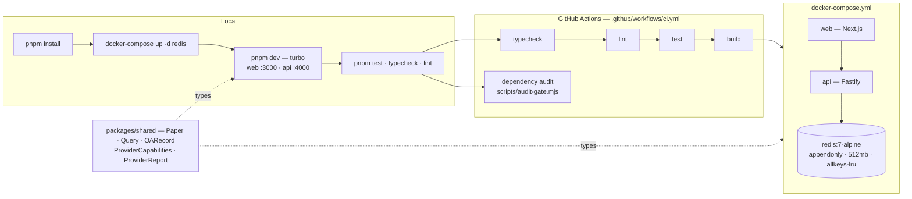

# Platform workflow

What actually happens at runtime, in the order it happens. The diagrams below
are the *verbs* of the platform; [`architecture-diagram.md`](./architecture-diagram.md)
holds the nouns — the component map and the repository layout.

The fenced blocks render directly in GitHub, VS Code, and most Markdown
viewers.

| Diagram | Answers |
| --- | --- |
| [1. Search, edge to answer](#1-search-edge-to-answer) | How a typed query becomes an HTTP response, and what the caches do on the way |
| [2. The orchestrator pipeline](#2-the-orchestrator-pipeline) | What happens between the fan-out and the page, and why the order is fixed |
| [3. One provider, one request](#3-one-provider-one-request) | The four-part shape every connector has, and what adding one costs |
| [4. Paper detail and PDF download](#4-paper-detail-and-pdf-download) | The other two public routes |
| [5. Engineering workflow](#5-engineering-workflow) | Install, run, test, ship |

Standalone SVG renders live in [`diagrams/`](./diagrams), for viewers that do
not run Mermaid:

| Diagram | SVG |
| --- | --- |
| Search, edge to answer | [`diagrams/workflow-search.svg`](./diagrams/workflow-search.svg) |
| The orchestrator pipeline | [`diagrams/workflow-orchestrator.svg`](./diagrams/workflow-orchestrator.svg) |
| One provider, one request | [`diagrams/workflow-provider.svg`](./diagrams/workflow-provider.svg) |
| Paper detail and PDF download | [`diagrams/workflow-paper-pdf.svg`](./diagrams/workflow-paper-pdf.svg) |
| Engineering workflow | [`diagrams/workflow-engineering.svg`](./diagrams/workflow-engineering.svg) |

Regenerate them after editing a block below. `mmdc` numbers its outputs in
source order, so they are renamed to the table above:

```bash
npx -p @mermaid-js/mermaid-cli mmdc -i docs/workflow.md -o docs/diagrams/workflow.svg -b white
```

---

## 1. Search, edge to answer

```mermaid
flowchart LR
  A(["Reader submits a query"]) --> B["/results — server component<br/>force-dynamic, revalidate 0"]

  B --> C["lib/search-params<br/>toList · toPage · toYear · toSort<br/>a hand-edited URL cannot reach the schema"]
  C --> D["lib/fetcher — the only place an API origin is decided"]

  D --> E{"Which side of the render?"}
  E -- "server" --> F["API_ORIGIN, read from the process at request time<br/>forwards the visitor's x-forwarded-for, so the API's<br/>rate limit keys on them and not on the web tier"]
  E -- "browser" --> G["stay relative — app/api/[...path]/route.ts"]

  G --> G1{"a path segment of . or .. ?"}
  G1 -- yes --> G2["404 — refused, not silently rewritten"]
  G1 -- no --> G3["drop hop-by-hop headers<br/>forward x-forwarded-for intact<br/>fetch API_ORIGIN + /api/…<br/>30s budget on the wait for an answer, not the transfer"]

  F --> H
  G3 --> H["POST /api/search — Fastify"]

  H --> I["cors · helmet · rate-limit<br/>120/min keyed on request.ip, /health exempt"]
  I --> J{"body matches searchBodySchema?"}
  J -- no --> J1["400 before the handler runs"]
  J -- yes --> K["SearchCacheManager.getCachedSearchResults<br/>key: search:hash(query):hash(page·sort·filters)"]

  K --> L{"L1 — MemoryCache<br/>bytes-bounded LRU"}
  L -- hit --> HIT
  L -- miss --> M{"L2 — Redis<br/>skipped while the circuit is open"}
  M -- hit --> M1["promote into L1"] --> HIT
  M -- miss --> N

  HIT["200 · X-Cache-Hit: true<br/>Cache-Control: max-age=300"] --> Z

  N["SingleFlight.run(keyFor(params))"] --> O{"a flight already in the air<br/>for this exact key?"}
  O -- yes --> O1["await it — X-Cache-Hit: coalesced"] --> Y
  O -- no --> P["runOrchestrator(params)"]

  P --> P1["parseQuery — doi wins over q"]
  P1 --> PIPE[["the orchestrator pipeline — diagram 2"]]
  PIPE --> Q["toSearchResponse<br/>hits · facets · providers<br/>complete · bounded"]

  Q --> R{"worthCaching — complete !== false"}
  R -- "every provider answered" --> S["cache the response<br/>Cache-Control: max-age=300"]
  R -- "one failed or timed out" --> T["do not store it<br/>Cache-Control: no-store<br/>so a retry can reach the providers that failed"]

  S --> Y
  T --> Y
  Y["200 · X-Cache-Hit: false | coalesced<br/>X-Response-Time"] --> Z

  Z["hits · facets · providers · complete · bounded"] --> ZA["ResultCard · FacetPanel · SortBar · Pagination"]
  Z --> ZB["ProviderCoverage — who answered, who was skipped and why<br/>complete:false — a source did not answer<br/>bounded:true — every source did, but the rescue was cut short<br/>either one renders as 'total is a lower bound'"]

  classDef gate stroke:#dc2626,stroke-width:2px
  classDef store stroke:#7c3aed,stroke-width:2px
  classDef exit stroke:#2563eb,stroke-width:2px
  class J,G1,R,O gate
  class L,M,K store
  class HIT,Y,Z exit
```



Two rules are worth reading off this diagram, because both were bugs before
they were rules:

- **The single flight wraps the whole miss**, cache write included — not just
  the fan-out. A miss costs tens of seconds across ten providers, which is a
  wide window for duplicates to arrive in.
- **A degraded answer is returned but never remembered.** Storing one would
  answer everybody for the next five minutes with a result nothing could get
  past, and the frontend's retry re-posts the identical request. The
  `Cache-Control` matches the store's decision, so no cache between here and
  the reader can reinstate it.

---

## 2. The orchestrator pipeline

`plan → fan out → merge → rank → filter → rescue → facet → paginate → enrich`.
The order is load-bearing: ranking after pagination ranks a page, ranking
before dedupe ranks duplicates, and faceting before filtering describes a set
the caller never sees.

```mermaid
flowchart LR
  Q(["Query — terms · phrases · doi · years"]) --> PLAN

  subgraph SELECT["Selection"]
    PLAN{"plan — per provider"}
    PLAN -- "query.doi and doiLookup" --> ASK
    PLAN -- "no doi and keywordSearch" --> ASK
    PLAN -- "capability missing" --> SKIP["skipped, with the reason named<br/>bioRxiv on a keyword query, say —<br/>reported, not counted as a failure"]
    ASK["planned"]
  end

  ASK --> FAN

  subgraph FANOUT["Fan-out — parallel, one budget per provider"]
    FAN["for each planned provider"]
    FAN --> PC{"ProviderCache<br/>provider · nativeQuery · depth · offset · normalizerVersion"}
    PC -- hit --> OUT["Paper[] + ProviderReport"]
    PC -- miss --> RUN["translate → fetch → normalize<br/>inside a 20s AbortController budget"]
    RUN --> RES{"outcome"}
    RES -- "resolved" --> OK["status: ok · retrieved · latency"] --> OUT
    RES -- "budget expired" --> TO["status: timeout — retryable,<br/>the abort stops it decoding on a shared thread"] --> OUT
    RES -- "threw" --> ER["status: error"] --> OUT
  end

  OUT --> MERGE

  MERGE["mergePapers — group by identityKey<br/>DOI, else title+year, else source ref<br/>highest-priority record is the base;<br/>every gap filled from the best record that has it,<br/>attributed in fieldSources"]
  MERGE --> RANK["rank<br/>RRF over each provider's own ordering (k=60)<br/>+ query/title/abstract overlap ×1.25<br/>+ record quality as a tiebreak only"]

  RANK --> PART{"partitionByPolicy"}
  PART -- "fails a filter the caller ticked" --> DROP["settled — dropped.<br/>No authority supplies these fields."]
  PART -- "passes everything" --> KEPT["kept"]
  PART -- "fails only the OA / full-text gate<br/>and carries a DOI" --> CAND["candidates"]

  CAND --> RESCUE

  subgraph RESCUEBOX["Rescue — the one enrichment paid for before pagination"]
    RESCUE["first SEARCH_RESCUE_LIMIT candidates, in rank order<br/>default 200, independent of the page"]
    RESCUE --> RAUTH["only authorities authoritative on<br/>fullText or oaStatus — today, Unpaywall alone"]
    RAUTH --> RETEST{"applyPolicy again, in full"}
    RETEST -- "now passes" --> BACK["rejoins at the rank it already had"]
    RETEST -- "still fails" --> GONE["dropped exactly as before"]
    RESCUE -.-> RPT["RescueReport — candidates · examined · rescued · bounded"]
  end

  KEPT --> REBUILD
  BACK --> REBUILD
  REBUILD["rebuild by walking the ranked list<br/>— substitution, not appending"]

  REBUILD --> SORT["sortPapers — after filtering, before pagination"]
  SORT --> FACET["generateFacets over the filtered set<br/>with facetBaseSets: a facet is not counted<br/>over its own selection, so a second year<br/>can still be ticked"]
  FACET --> PAGE["paginate — slice(page-1 × pageSize, +pageSize)"]

  PAGE --> E0

  subgraph ENRICHBOX["enrichPage — the page, never the set"]
    E0["pass 0, concurrent: Crossref · OpenAlex · Unpaywall<br/>first to supply a field owns it in fieldSources"]
    E0 --> E1["pass 1: OpenCitations, and only for<br/>papers still missing a citation count"]
    E1 --> EAPPLY["applyFacts · preferredPdfUrl rewrites hosts<br/>that advertise a PDF they serve an interstitial for"]
    E0 -.-> EBUD{"per-lookup timeout,<br/>whole-step budget"}
    E1 -.-> EBUD
    EBUD -- "expired" --> EAB["abandoned lookups are reported,<br/>never thrown — the page still ships"]
  end

  EAPPLY --> RESORT["sortPapers again — enrichment just rewrote<br/>title, authors, year, venue, publisher, citationCount,<br/>which are the keys the page was ordered by"]
  RESORT --> DONE(["papers · total · facets · reports · authorities · rescue · complete"])

  ENRICHBOX -.-> AC[("AuthorityCache — per-search memo of<br/>(authority, DOI) → facts, shared with the rescue,<br/>so a rescued paper on the visible page<br/>is not asked about twice")]
  RESCUEBOX -.-> AC

  classDef gate stroke:#dc2626,stroke-width:2px
  classDef store stroke:#7c3aed,stroke-width:2px
  class PLAN,PART,RETEST,RES,EBUD gate
  class PC,AC store
```



**Providers and authorities are different kinds of thing.** A provider answers
a query with records; an authority is asked about a record already in hand and
never adds one. So an authority failing leaves the result set whole, while a
provider failing makes `total` a lower bound — which is exactly what
`complete: false` reports.

**Enrichment cannot change which papers are on the page**, which is what lets
`total`, the facets and the page boundary all keep describing the set they were
computed over. The rescue is the single exception, and it can only ever add
papers back.

---

## 3. One provider, one request

Every connector under `apps/api/src/providers/` has the same four parts, so the
only impure one is isolated and the other three are testable without a network.



Adding a provider is one directory plus one row in the registry. Nothing in the
orchestrator learns its name.

---

## 4. Paper detail and PDF download

```mermaid
flowchart TD
  A(["Reader opens a paper"]) --> B["/paper/:id — client component"]
  B --> C{"sessionStorage — stashed by ResultCard<br/>on the way out of the results list"}
  C -- hit --> C1["render immediately"]
  C -- miss --> D
  C1 --> D["GET /api/paper/:id"]

  D --> E{"PaperCacheManager.getCachedPaper<br/>paper:hash(id)"}
  E -- hit --> Z["200 · Cache-Control: max-age=600"]
  E -- miss --> F["lookupPaper('source:nativeId')"]

  F --> G["splitPaperId — on the first colon only<br/>DOIs and OpenAIRE ids carry their own"]
  G --> H{"does the registry know this provider?"}
  H -- no --> N404
  H -- yes --> I{"does it have a by-id endpoint?"}

  I -- yes --> J["entry.lookup(nativeId)"]
  I -- no --> K["entry.search(parseQuery(nativeId), depth 10)<br/>openAccessOnly:false — whether a record is open<br/>is a fact about it, not a condition on finding it"]

  J --> L{"is it the record that was asked for?<br/>source and nativeId compared"}
  K --> L
  L -- no --> N404["404 — a near miss is not somebody else's paper"]
  L -- yes --> M["enrichPage on the single record<br/>so a shared link and a click-through<br/>return the same body"]
  M --> N["toOARecord → cachePaperDetails"] --> Z

  Z --> P["PaperHeader · PaperAbstract · PaperMetadata<br/>PaperCitations · PaperActions · RelatedPapers"]
  P -.-> RP["RelatedPapers links the topics already on the record<br/>to the searches they stand for — no second fan-out"]

  P --> Q(["Download PDF"])
  Q --> R["POST /api/download-pdf {paperId, pdfUrl}"]
  R --> S{"assertPublicHttpUrl<br/>scheme · DNS resolution · private ranges"}
  S -- "private or unroutable" --> S1["refused — ESSRFREFUSED"]
  S -- "public" --> T["fetchPdfStream, capped at 50 MB<br/>guardedLookup re-checks on redirect"]
  T --> U["streamed back as application/pdf<br/>Content-Disposition: attachment"]

  classDef gate stroke:#dc2626,stroke-width:2px
  classDef store stroke:#7c3aed,stroke-width:2px
  class H,I,L,S gate
  class C,E store
```



Opening a paper triggers no search. The PDF is proxied rather than linked
because publishers rarely permit a cross-origin fetch from the browser — and
because the proxy is where the SSRF guard can live.

---

## 5. Engineering workflow



`API_ORIGIN` is deliberately *not* prefixed `NEXT_PUBLIC_`: that prefix is what
bakes a value into the bundle at build time, which is what pinned the web image
to `localhost` and made it unpromotable from staging to production. The route
handler reads it per request instead, so one image runs anywhere.
